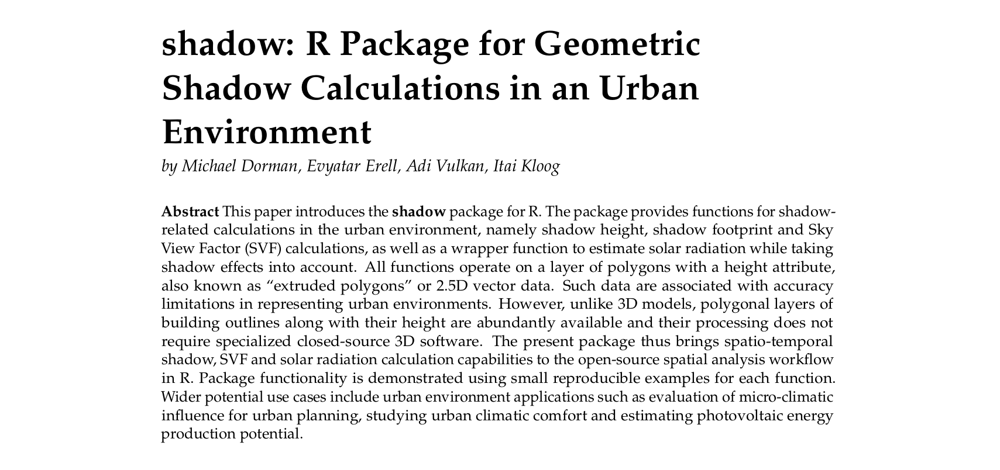
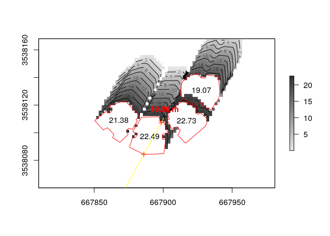

<!-- README.md is generated from README.Rmd. Please edit that file -->

[](https://cran.r-project.org/package=shadow)
[](https://cran.r-project.org/package=shadow)

### Introduction

`shadow` is an R package for geometric shadow calculations in an urban
environment. A detailed description can be found in the [R Journal paper
(2019)](https://journal.r-project.org/archive/2019/RJ-2019-024/RJ-2019-024.pdf):

[](https://journal.r-project.org/archive/2019/RJ-2019-024/RJ-2019-024.pdf)

### Installation

CRAN version:

``` r
install.packages("shadow")
```

GitHub version:

``` r
install.packages("devtools")
devtools::install_github("michaeldorman/shadow")
```

### Quick demo

``` r
library(shadow)
#> Loading required package: sp
library(raster)

# Point
location = rgeos::gCentroid(build)
#> Warning in fun(libname, pkgname): rgeos: versions of GEOS runtime 3.8.0-CAPI-1.13.1
#> and GEOS at installation 3.7.1-CAPI-1.11.1differ

# Time
time = as.POSIXct(
  "2004-12-24 13:30:00",
  tz = "Asia/Jerusalem"
  )

# Location in geographical coordinates
location_geo = sp::spTransform(
  location,
  "+proj=longlat +datum=WGS84"
  )

# Solar position
solar_pos = maptools::solarpos(
  crds = location_geo,
  dateTime = time
  )
solar_pos
#>          [,1]     [,2]
#> [1,] 208.7333 28.79944

# Shadow height at a single point
h = shadowHeight(
  location = location,
  obstacles = build,
  obstacles_height_field = "BLDG_HT",
  solar_pos = solar_pos
  )

# Result
h
#>          [,1]
#> [1,] 19.86451

# Visualization
sun = shadow:::.sunLocation(
  location = location,
  sun_az = solar_pos[1, 1],
  sun_elev = solar_pos[1, 2]
  )
sun_ray = ray(from = location, to = sun)
build_outline = as(build, "SpatialLinesDataFrame")
inter = rgeos::gIntersection(build_outline, sun_ray)
plot(build)
plot(sun_ray, add = TRUE, col = "yellow")
plot(location, add = TRUE)
text(location, paste(round(h, 2), "m"), pos = 3)
plot(inter, add = TRUE, col = "red")
```

<!-- -->

``` r

# Raster template
ext = as(raster::extent(build)+50, "SpatialPolygons")
r = raster::raster(ext, res = 2)
proj4string(r) = proj4string(build)

# Shadow height surface
height_surface = shadowHeight(
  location = r,
  obstacles = build,
  obstacles_height_field = "BLDG_HT",
  solar_pos = solar_pos,
  parallel = 2
  )

# Visualization
plot(height_surface, col = grey(seq(0.9, 0.2, -0.01)))
contour(height_surface, add = TRUE)
plot(build, add = TRUE, border = "red")
text(rgeos::gCentroid(build, byid = TRUE), build$BLDG_HT)
text(location, paste(round(h, 2), "m"), pos = 3, col = "red", font = 2)
plot(sun_ray, add = TRUE, col = "yellow")
plot(inter, add = TRUE, col = "red")
plot(location, add = TRUE)
```

<!-- -->
