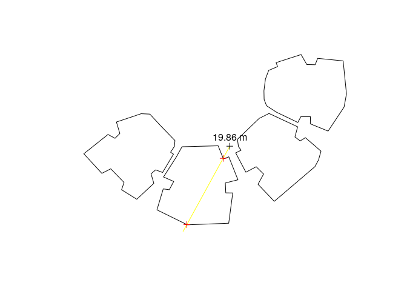

<!-- README.md is generated from README.Rmd. Please edit that file -->
### Installation

``` r
install.packages("devtools")
devtools::install_github("michaeldorman/shadow")
```

### Quick demo

``` r
library(shadow)
library(sp)
library(rgeos)
#> rgeos version: 0.3-21, (SVN revision 540)
#>  GEOS runtime version: 3.5.0-CAPI-1.9.0 r4084 
#>  Linking to sp version: 1.2-3 
#>  Polygon checking: TRUE
library(raster)

# Single location
ctr = gCentroid(build)
plot(build)
plot(ctr, add = TRUE)
location = ctr
build = build
height_field = "BLDG_HT"
sun_az = 30
sun_elev = 20
sun = shadow:::sunLocation(location = location, sun_az = sun_az, sun_elev = sun_elev)
sun_ray = ray(from = location, to = sun)
build_outline = as(build, "SpatialLinesDataFrame")
inter = gIntersection(build_outline, sun_ray)
plot(sun_ray, add = TRUE, col = "yellow")
plot(inter, add = TRUE, col = "red")
```



``` r
shadeHeight(location, build, height_field, sun_az, sun_elev)
#> [1] 10.31931

# Grid
ext = as(extent(build), "SpatialPolygons")
r = raster(ext, res = 3)
proj4string(r) = proj4string(build)
grid = rasterToPoints(r, spatial = TRUE)
grid = SpatialPointsDataFrame(grid, data.frame(grid_id = 1:length(grid)))
build = build
height_field = "BLDG_HT"
sun_az = 70
sun_elev = 30
for(i in 1:length(grid)) {
  grid$shade_height[i] =
    shadeHeight(grid[i, ], build, height_field, sun_az, sun_elev)
}
shade = as(grid, "SpatialPixelsDataFrame")
shade = raster(shade, layer = "shade_height")
plot(shade, col = grey(seq(0.9, 0.2, -0.01)))
contour(shade, add = TRUE)
plot(build, add = TRUE, border = "red")
```


### To-do list

-   Check for other methods of spatial join between intersection points and buildings (without a buffer)
-   Replace custom sun position function with function from maptools

### Ideas for future development

-   Sky View Factor (SVF) calculation
-   DEM-based shade calculation
-   Shade footprint on ground as vector layer
-   Parallel computing capabilities
